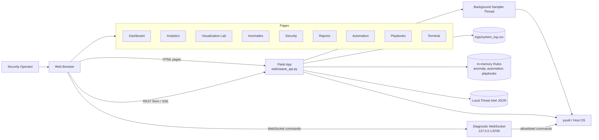
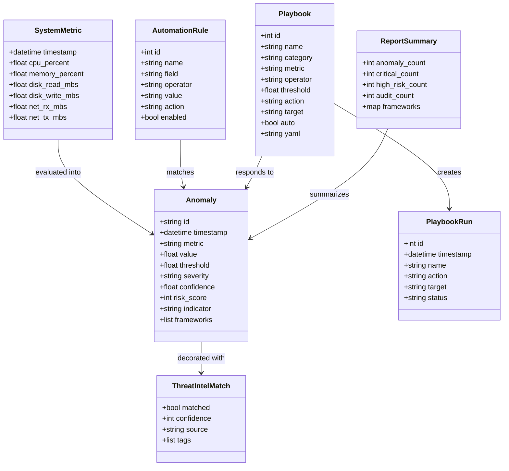
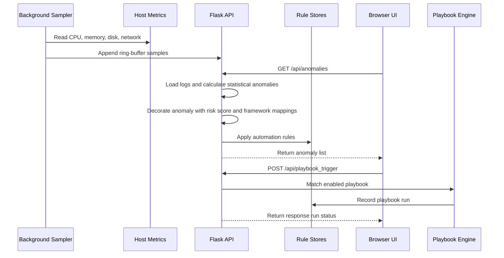
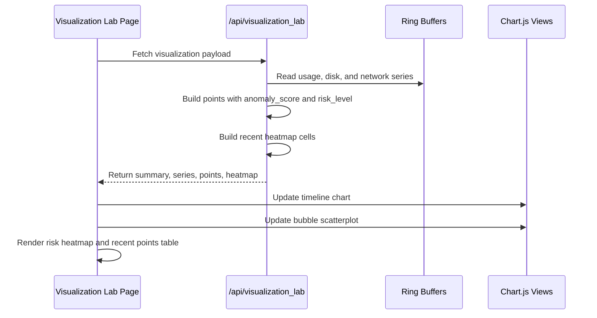
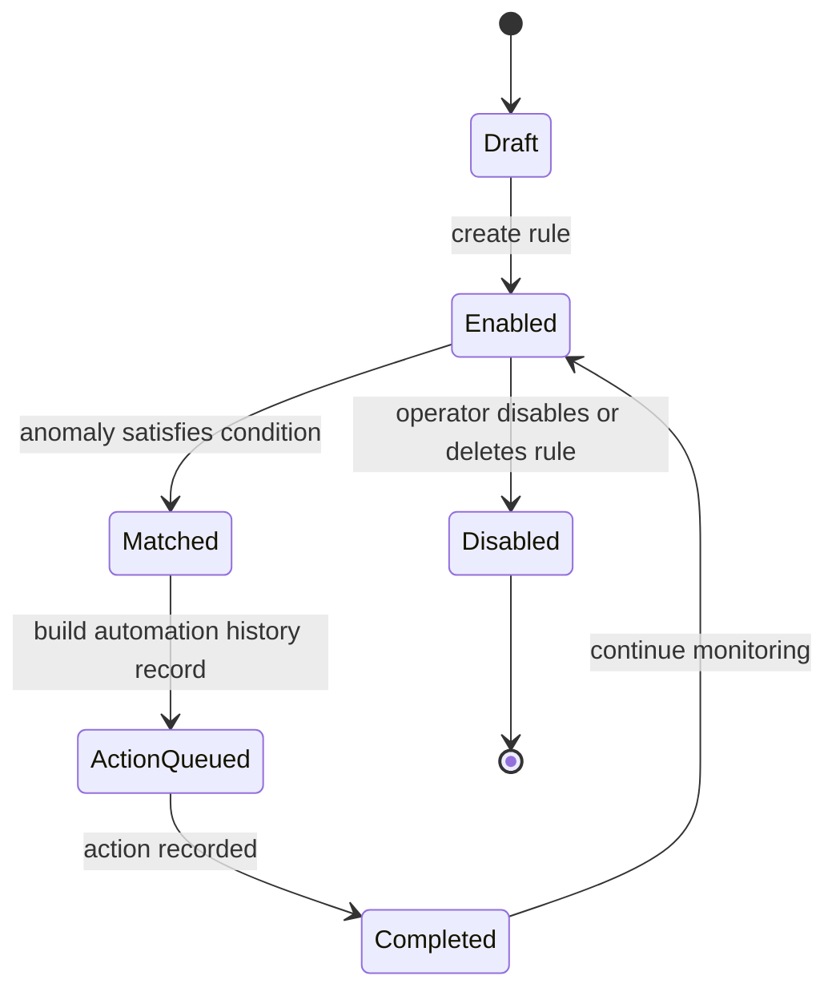
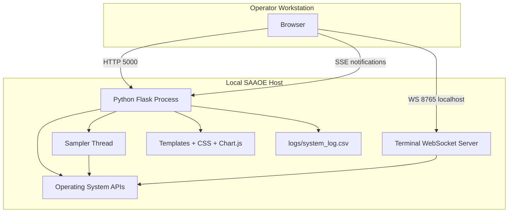

# SAAOE UML Diagrams

These diagrams describe the current SAAOE Flask dashboard, telemetry pipeline, anomaly workflow, and response surfaces. They use Mermaid so GitHub can render them directly from Markdown.

## System Component Diagram

## Domain Class Diagram

## Anomaly Detection and Response Sequence

## Visualization Lab Sequence

## Automation Rule State Diagram

## Runtime Deployment Diagram

