# SAAOE UML Diagrams

These diagrams describe the current SAAOE Flask dashboard, telemetry pipeline, anomaly workflow, and response surfaces. They use Mermaid so GitHub can render them directly from Markdown.

## System Component Diagram

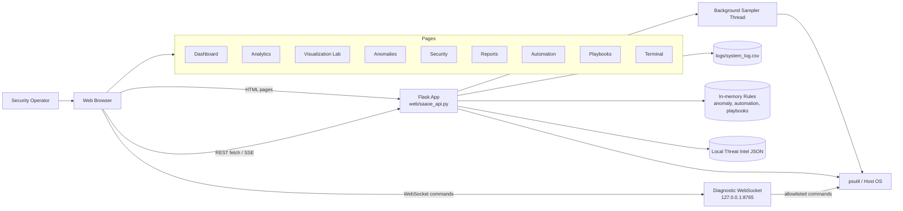
```mermaid
flowchart LR
    Operator[Security Operator]
    Browser[Web Browser]
    Flask[Flask App<br/>web/saaoe_api.py]
    Sampler[Background Sampler Thread]
    Psutil[psutil / Host OS]
    Logs[(logs/system_log.csv)]
    Rules[(In-memory Rules<br/>anomaly, automation, playbooks)]
    ThreatIntel[(Local Threat Intel JSON)]
    TerminalWS[Diagnostic WebSocket<br/>127.0.0.1:8765]

    Operator --> Browser
    Browser -->|HTML pages| Flask
    Browser -->|REST fetch / SSE| Flask
    Browser -->|WebSocket commands| TerminalWS
    Flask --> Sampler
    Sampler --> Psutil
    Flask --> Psutil
    Flask --> Logs
    Flask --> Rules
    Flask --> ThreatIntel
    TerminalWS -->|allowlisted commands| Psutil

    subgraph Pages
      Dashboard[Dashboard]
      Analytics[Analytics]
      VisualizationLab[Visualization Lab]
      Anomalies[Anomalies]
      Security[Security]
      Reports[Reports]
      Automation[Automation]
      Playbooks[Playbooks]
      Terminal[Terminal]
    end

    Browser --> Pages
```

## Domain Class Diagram

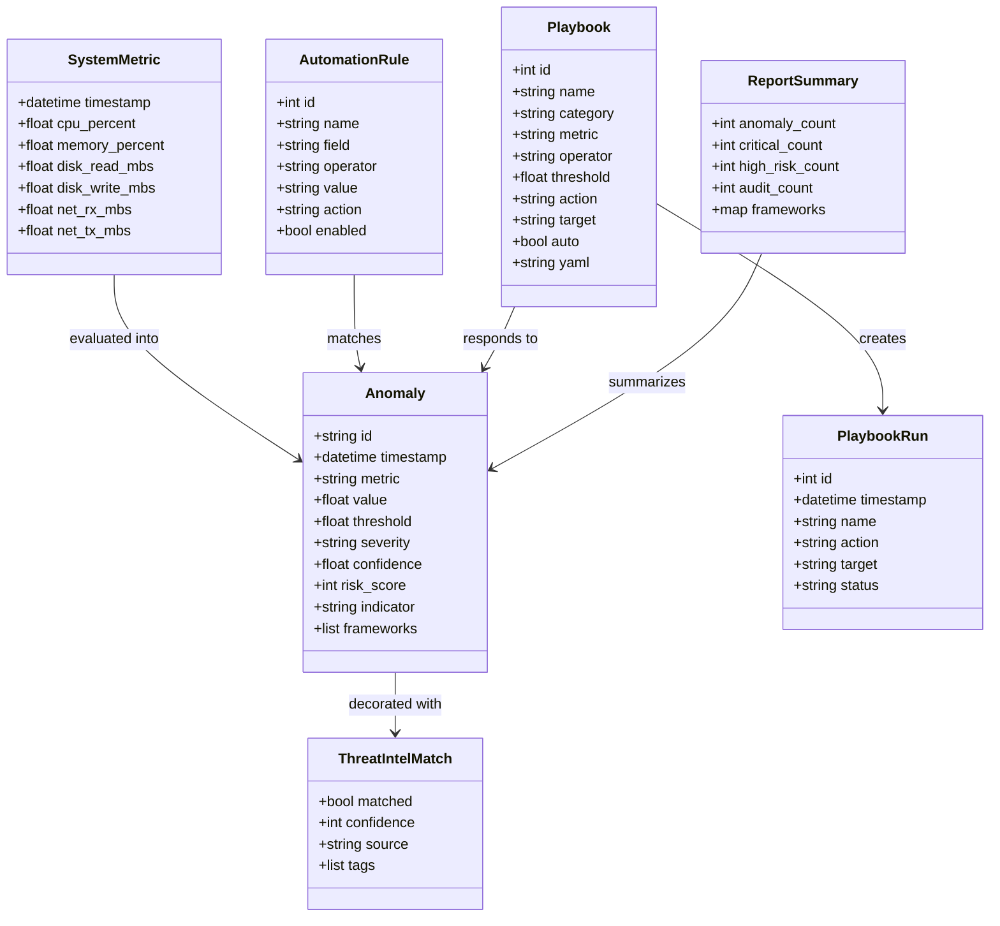
```mermaid
classDiagram
    class SystemMetric {
        +datetime timestamp
        +float cpu_percent
        +float memory_percent
        +float disk_read_mbs
        +float disk_write_mbs
        +float net_rx_mbs
        +float net_tx_mbs
    }

    class Anomaly {
        +string id
        +datetime timestamp
        +string metric
        +float value
        +float threshold
        +string severity
        +float confidence
        +int risk_score
        +string indicator
        +list frameworks
    }

    class ThreatIntelMatch {
        +bool matched
        +int confidence
        +string source
        +list tags
    }

    class AutomationRule {
        +int id
        +string name
        +string field
        +string operator
        +string value
        +string action
        +bool enabled
    }

    class Playbook {
        +int id
        +string name
        +string category
        +string metric
        +string operator
        +float threshold
        +string action
        +string target
        +bool auto
        +string yaml
    }

    class PlaybookRun {
        +int id
        +datetime timestamp
        +string name
        +string action
        +string target
        +string status
    }

    class ReportSummary {
        +int anomaly_count
        +int critical_count
        +int high_risk_count
        +int audit_count
        +map frameworks
    }

    SystemMetric --> Anomaly : evaluated into
    Anomaly --> ThreatIntelMatch : decorated with
    AutomationRule --> Anomaly : matches
    Playbook --> Anomaly : responds to
    Playbook --> PlaybookRun : creates
    ReportSummary --> Anomaly : summarizes
```

## Anomaly Detection and Response Sequence

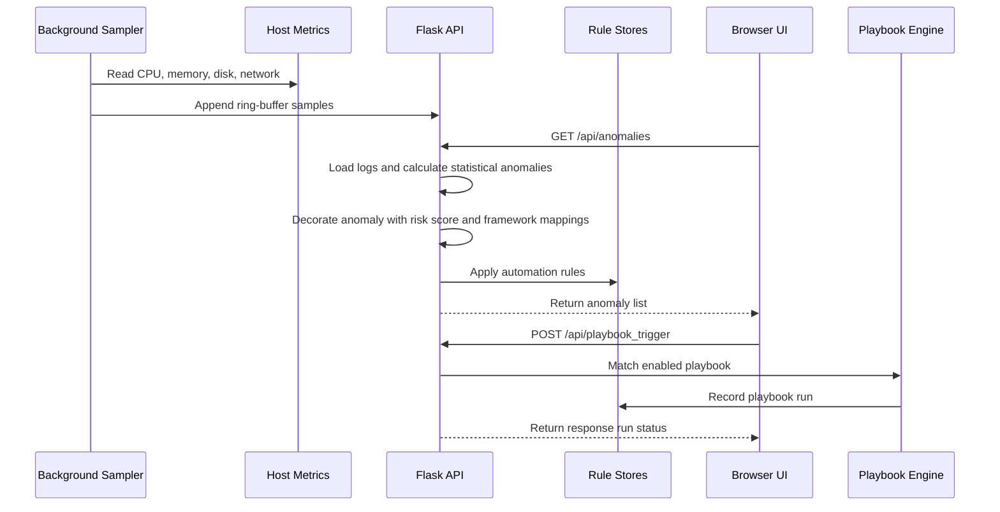
```mermaid
sequenceDiagram
    participant Sampler as Background Sampler
    participant Host as Host Metrics
    participant API as Flask API
    participant Rules as Rule Stores
    participant UI as Browser UI
    participant PB as Playbook Engine

    Sampler->>Host: Read CPU, memory, disk, network
    Sampler->>API: Append ring-buffer samples
    UI->>API: GET /api/anomalies
    API->>API: Load logs and calculate statistical anomalies
    API->>API: Decorate anomaly with risk score and framework mappings
    API->>Rules: Apply automation rules
    API-->>UI: Return anomaly list
    UI->>API: POST /api/playbook_trigger
    API->>PB: Match enabled playbook
    PB->>Rules: Record playbook run
    API-->>UI: Return response run status
```

## Visualization Lab Sequence

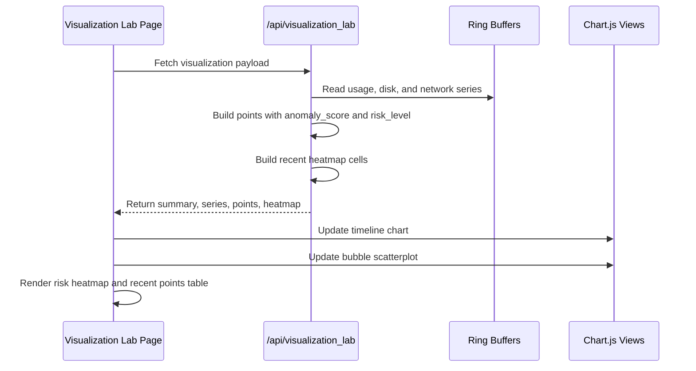
```mermaid
sequenceDiagram
    participant UI as Visualization Lab Page
    participant API as /api/visualization_lab
    participant Buffers as Ring Buffers
    participant Charts as Chart.js Views

    UI->>API: Fetch visualization payload
    API->>Buffers: Read usage, disk, and network series
    API->>API: Build points with anomaly_score and risk_level
    API->>API: Build recent heatmap cells
    API-->>UI: Return summary, series, points, heatmap
    UI->>Charts: Update timeline chart
    UI->>Charts: Update bubble scatterplot
    UI->>UI: Render risk heatmap and recent points table
```

## Automation Rule State Diagram

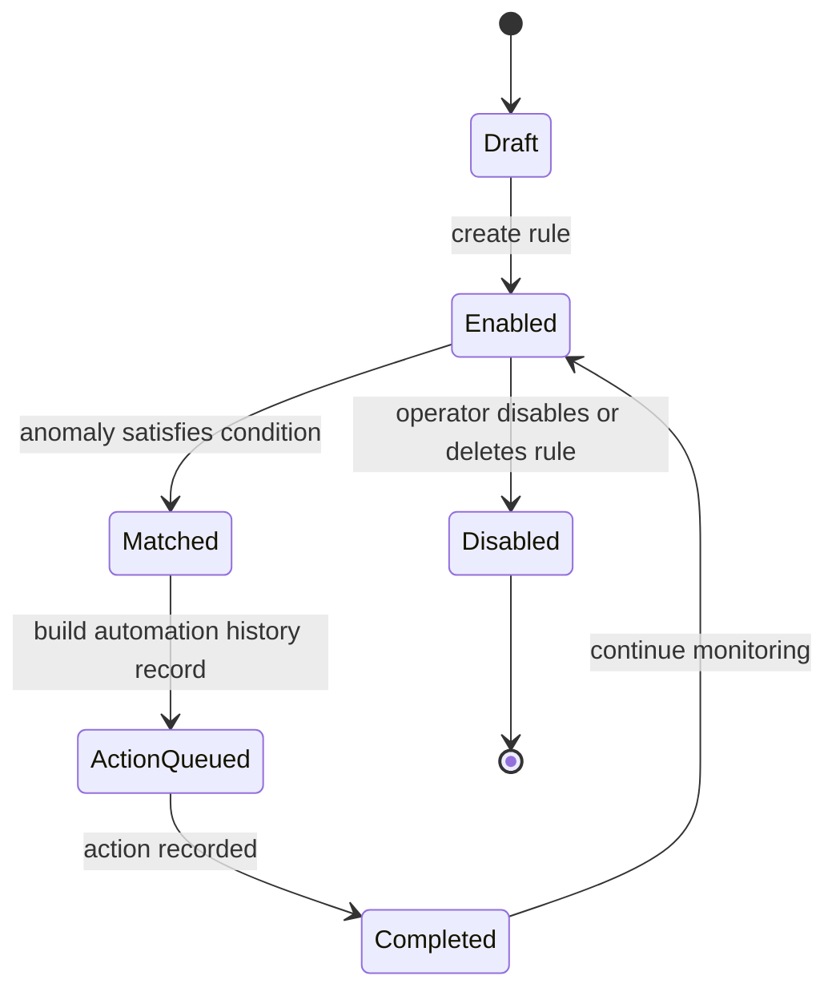
```mermaid
stateDiagram-v2
    [*] --> Draft
    Draft --> Enabled: create rule
    Enabled --> Matched: anomaly satisfies condition
    Matched --> ActionQueued: build automation history record
    ActionQueued --> Completed: action recorded
    Completed --> Enabled: continue monitoring
    Enabled --> Disabled: operator disables or deletes rule
    Disabled --> [*]
```

## Runtime Deployment Diagram

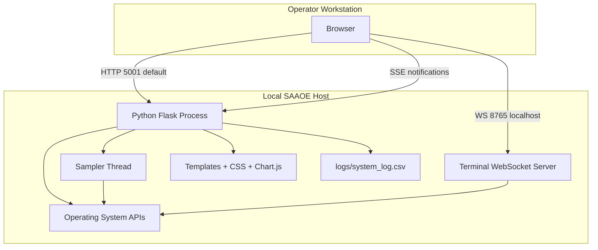
```mermaid
flowchart TB
    subgraph HostMachine["Local SAAOE Host"]
        FlaskProcess["Python Flask Process"]
        SamplerThread["Sampler Thread"]
        TerminalServer["Terminal WebSocket Server"]
        StaticAssets["Templates + CSS + Chart.js"]
        LogFile["logs/system_log.csv"]
        HostOS["Operating System APIs"]
    end

    subgraph Client["Operator Workstation"]
        Browser["Browser"]
    end

    Browser -->|HTTP 5001 default| FlaskProcess
    Browser -->|SSE notifications| FlaskProcess
    Browser -->|WS 8765 localhost| TerminalServer
    FlaskProcess --> StaticAssets
    FlaskProcess --> LogFile
    FlaskProcess --> HostOS
    SamplerThread --> HostOS
    FlaskProcess --> SamplerThread
    TerminalServer --> HostOS
```

## Feature and Page UML

The diagrams below map each dashboard page to the Flask endpoints, browser widgets, and local data sources it depends on.

### Navigation and Page Map

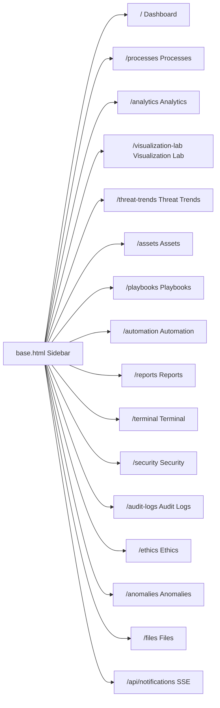
```mermaid
flowchart LR
    Base[base.html Sidebar]
    Base --> Dashboard["/ Dashboard"]
    Base --> Processes["/processes Processes"]
    Base --> Analytics["/analytics Analytics"]
    Base --> Visualization["/visualization-lab Visualization Lab"]
    Base --> ThreatTrends["/threat-trends Threat Trends"]
    Base --> Assets["/assets Assets"]
    Base --> Playbooks["/playbooks Playbooks"]
    Base --> Automation["/automation Automation"]
    Base --> Reports["/reports Reports"]
    Base --> Terminal["/terminal Terminal"]
    Base --> Security["/security Security"]
    Base --> AuditLogs["/audit-logs Audit Logs"]
    Base --> Ethics["/ethics Ethics"]
    Base --> Anomalies["/anomalies Anomalies"]
    Base --> Files["/files Files"]

    Base --> Notifications["/api/notifications SSE"]
```

### Dashboard Page

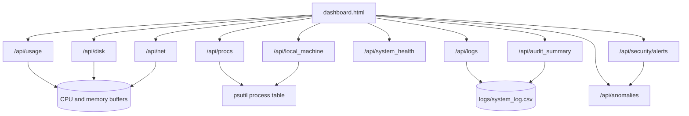
```mermaid
flowchart TB
    DashboardPage[dashboard.html]
    DashboardPage --> Usage["/api/usage"]
    DashboardPage --> Disk["/api/disk"]
    DashboardPage --> Net["/api/net"]
    DashboardPage --> Procs["/api/procs"]
    DashboardPage --> Local["/api/local_machine"]
    DashboardPage --> Health["/api/system_health"]
    DashboardPage --> Logs["/api/logs"]
    DashboardPage --> Audit["/api/audit_summary"]
    DashboardPage --> SecurityAlerts["/api/security/alerts"]
    DashboardPage --> Anomalies["/api/anomalies"]

    Usage --> RingBuffers[(CPU and memory buffers)]
    Disk --> RingBuffers
    Net --> RingBuffers
    Procs --> Psutil[psutil process table]
    Local --> Psutil
    Logs --> SystemLog[(logs/system_log.csv)]
    SecurityAlerts --> Anomalies
    Audit --> SystemLog
```

### Processes Page

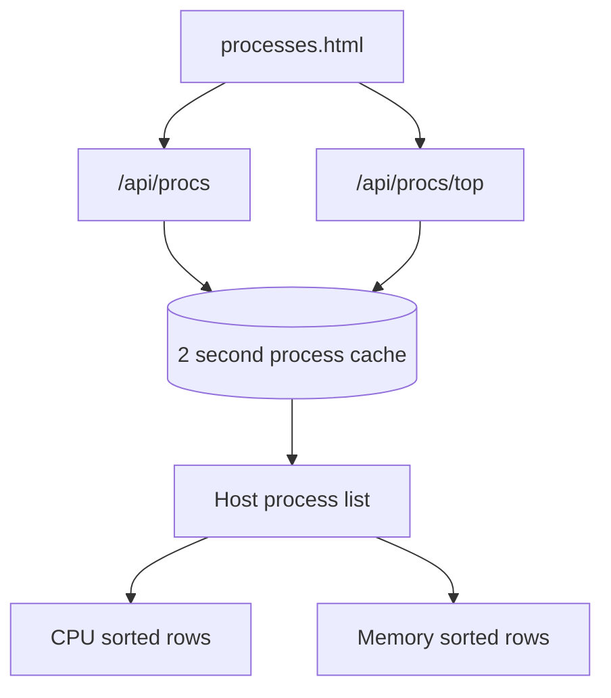
```mermaid
flowchart TB
    ProcessesPage[processes.html]
    ProcessesPage --> ProcessApi["/api/procs"]
    ProcessesPage --> TopProcessApi["/api/procs/top"]
    ProcessApi --> ProcessCache[(2 second process cache)]
    TopProcessApi --> ProcessCache
    ProcessCache --> HostProcesses[Host process list]
    HostProcesses --> CpuTop[CPU sorted rows]
    HostProcesses --> MemTop[Memory sorted rows]
```

### Analytics Page

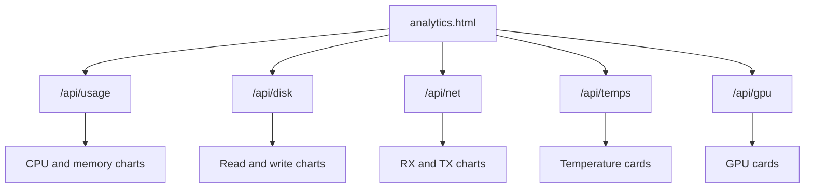
```mermaid
flowchart TB
    AnalyticsPage[analytics.html]
    AnalyticsPage --> Usage["/api/usage"]
    AnalyticsPage --> Disk["/api/disk"]
    AnalyticsPage --> Net["/api/net"]
    AnalyticsPage --> Temps["/api/temps"]
    AnalyticsPage --> Gpu["/api/gpu"]

    Usage --> LineCharts[CPU and memory charts]
    Disk --> DiskCharts[Read and write charts]
    Net --> NetworkCharts[RX and TX charts]
    Temps --> SensorCards[Temperature cards]
    Gpu --> GpuCards[GPU cards]
```

### Visualization Lab Page

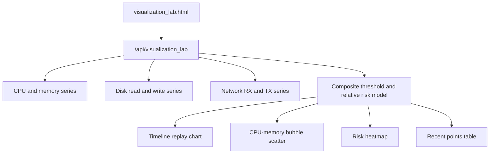
```mermaid
flowchart TB
    VisualizationPage[visualization_lab.html]
    VisualizationPage --> VisualizationApi["/api/visualization_lab"]
    VisualizationApi --> UsageSeries[CPU and memory series]
    VisualizationApi --> DiskSeries[Disk read and write series]
    VisualizationApi --> NetSeries[Network RX and TX series]
    VisualizationApi --> RiskModel[Composite threshold and relative risk model]
    RiskModel --> Timeline[Timeline replay chart]
    RiskModel --> Scatter[CPU-memory bubble scatter]
    RiskModel --> Heatmap[Risk heatmap]
    RiskModel --> PointsTable[Recent points table]
```

### Threat Trends Page

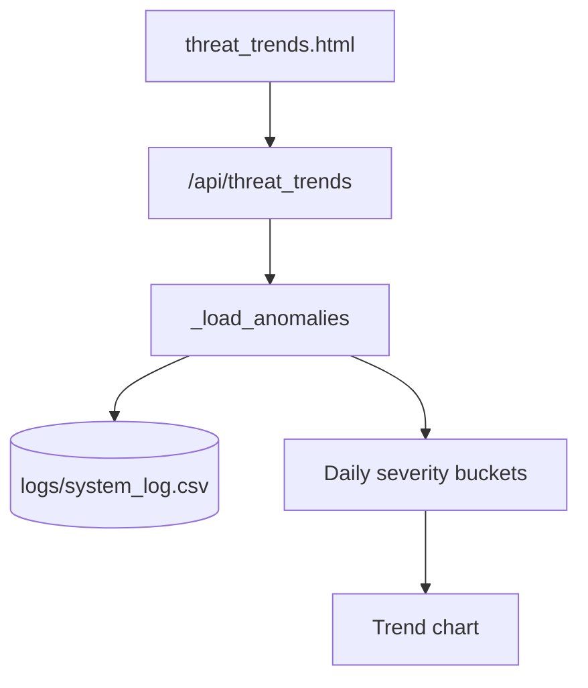
```mermaid
flowchart TB
    ThreatTrendsPage[threat_trends.html]
    ThreatTrendsPage --> TrendsApi["/api/threat_trends"]
    TrendsApi --> LoadAnomalies[_load_anomalies]
    LoadAnomalies --> SystemLog[(logs/system_log.csv)]
    LoadAnomalies --> Buckets[Daily severity buckets]
    Buckets --> TrendChart[Trend chart]
```

### Assets Page

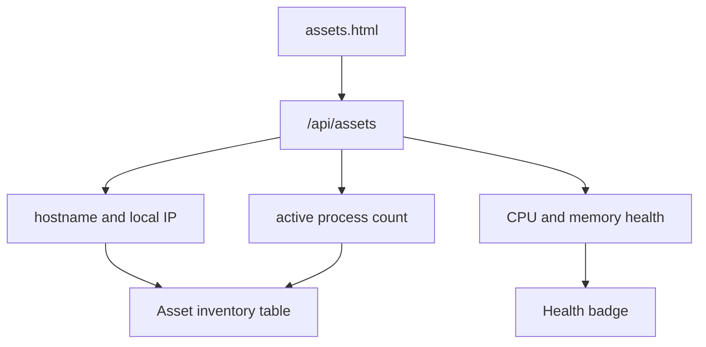
```mermaid
flowchart TB
    AssetsPage[assets.html]
    AssetsPage --> AssetsApi["/api/assets"]
    AssetsApi --> HostIdentity[hostname and local IP]
    AssetsApi --> CpuMemory[CPU and memory health]
    AssetsApi --> ProcessCount[active process count]
    HostIdentity --> AssetTable[Asset inventory table]
    CpuMemory --> HealthBadge[Health badge]
    ProcessCount --> AssetTable
```

### Playbooks Page

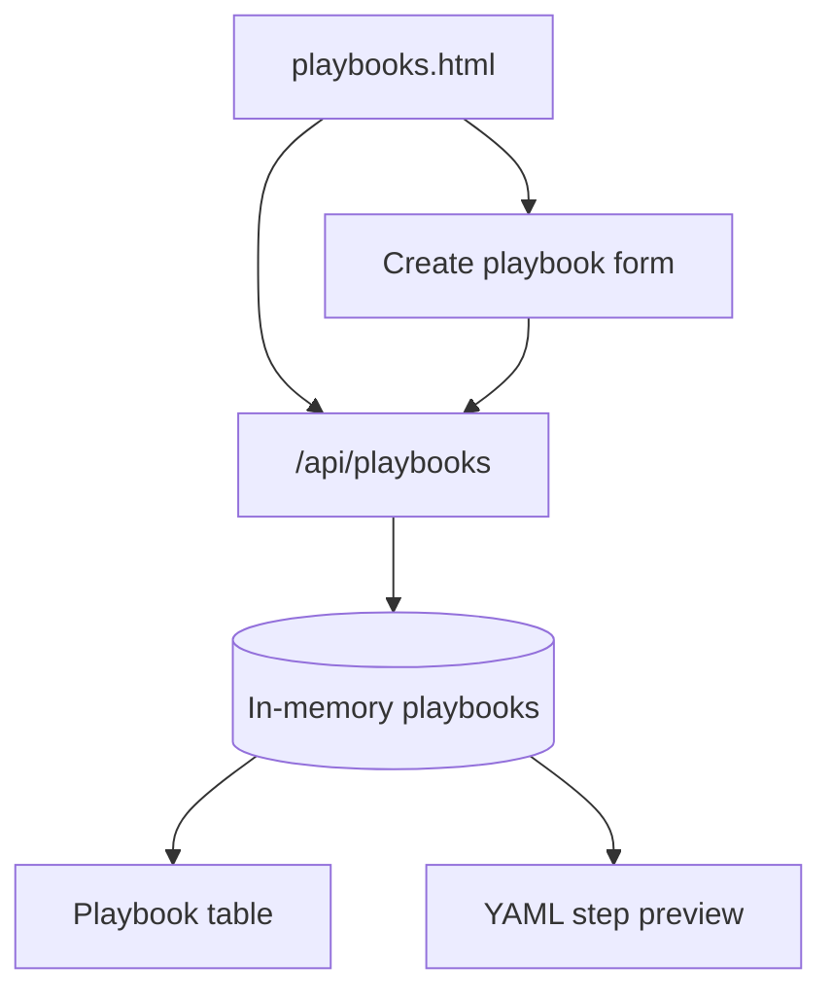
```mermaid
flowchart TB
    PlaybooksPage[playbooks.html]
    PlaybooksPage --> PlaybookApi["/api/playbooks"]
    PlaybookApi --> PlaybookStore[(In-memory playbooks)]
    PlaybooksPage --> CreatePlaybook[Create playbook form]
    CreatePlaybook --> PlaybookApi
    PlaybookStore --> PlaybookTable[Playbook table]
    PlaybookStore --> YamlSteps[YAML step preview]
```

### Automation Page

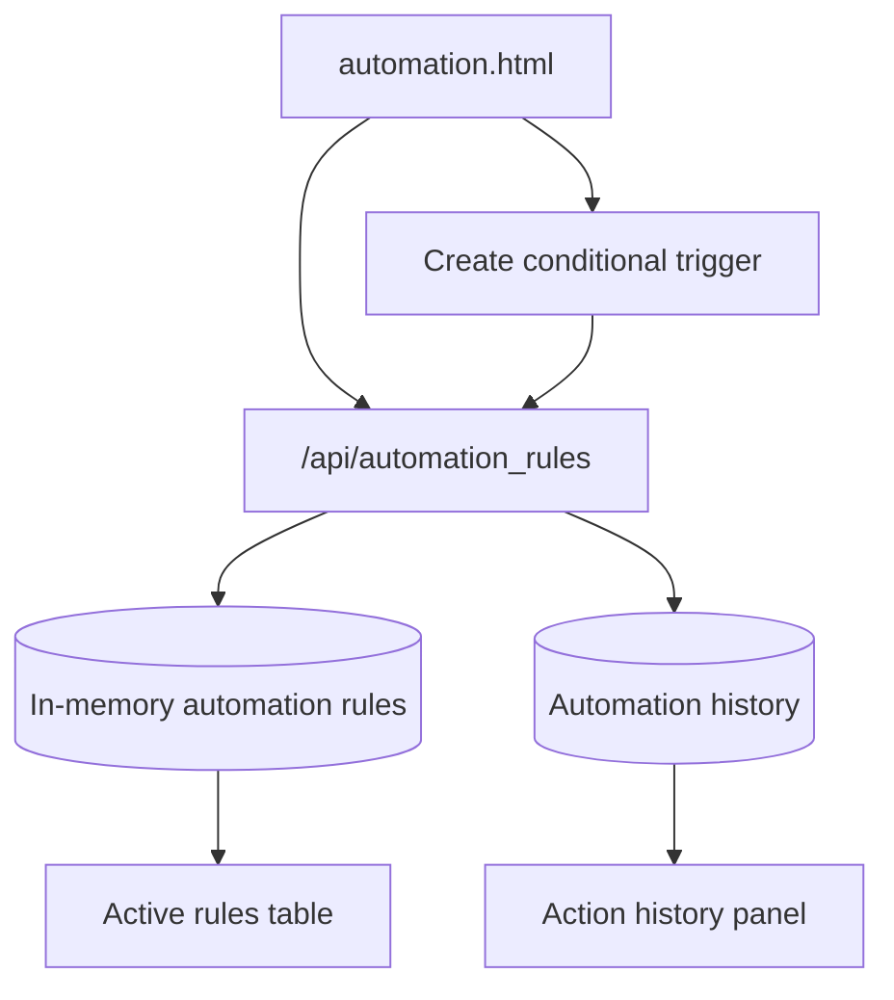
```mermaid
flowchart TB
    AutomationPage[automation.html]
    AutomationPage --> AutomationApi["/api/automation_rules"]
    AutomationApi --> AutomationStore[(In-memory automation rules)]
    AutomationApi --> AutomationHistory[(Automation history)]
    AutomationPage --> RuleForm[Create conditional trigger]
    RuleForm --> AutomationApi
    AutomationStore --> RulesTable[Active rules table]
    AutomationHistory --> HistoryPanel[Action history panel]
```

### Reports Page

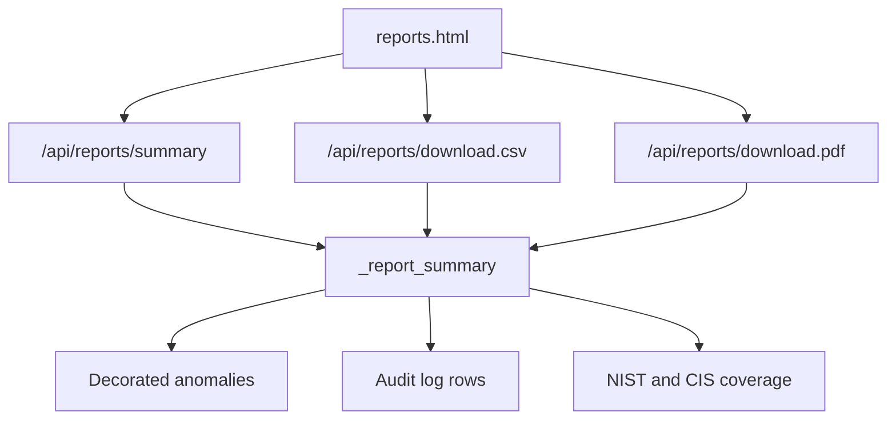
```mermaid
flowchart TB
    ReportsPage[reports.html]
    ReportsPage --> SummaryApi["/api/reports/summary"]
    ReportsPage --> CsvDownload["/api/reports/download.csv"]
    ReportsPage --> PdfDownload["/api/reports/download.pdf"]
    SummaryApi --> ReportSummary[_report_summary]
    CsvDownload --> ReportSummary
    PdfDownload --> ReportSummary
    ReportSummary --> AnomalySet[Decorated anomalies]
    ReportSummary --> AuditRows[Audit log rows]
    ReportSummary --> FrameworkCoverage[NIST and CIS coverage]
```

### Terminal Page

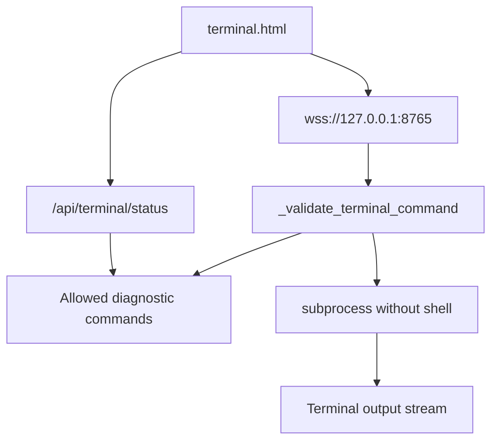
```mermaid
flowchart TB
    TerminalPage[terminal.html]
    TerminalPage --> StatusApi["/api/terminal/status"]
    TerminalPage --> WebSocket["wss://127.0.0.1:8765"]
    StatusApi --> Allowlist[Allowed diagnostic commands]
    WebSocket --> Validator[_validate_terminal_command]
    Validator --> Allowlist
    Validator --> Subprocess[subprocess without shell]
    Subprocess --> OutputStream[Terminal output stream]
```

### Security Page

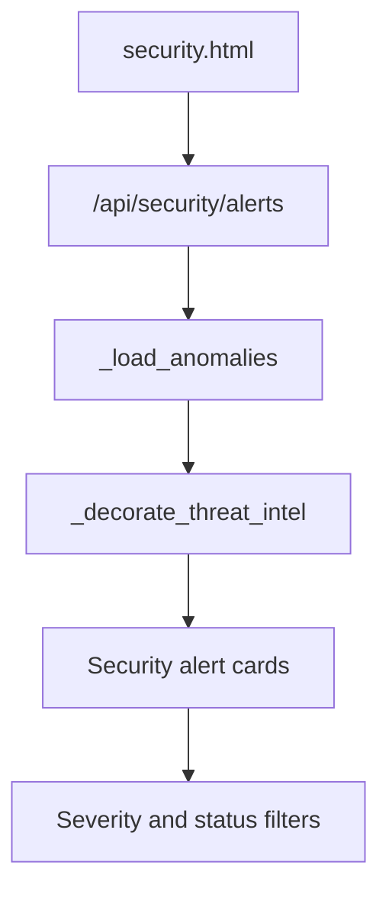
```mermaid
flowchart TB
    SecurityPage[security.html]
    SecurityPage --> SecurityAlerts["/api/security/alerts"]
    SecurityAlerts --> LoadAnomalies[_load_anomalies]
    LoadAnomalies --> ThreatIntel[_decorate_threat_intel]
    ThreatIntel --> AlertCards[Security alert cards]
    AlertCards --> Filters[Severity and status filters]
```

### Audit Logs Page

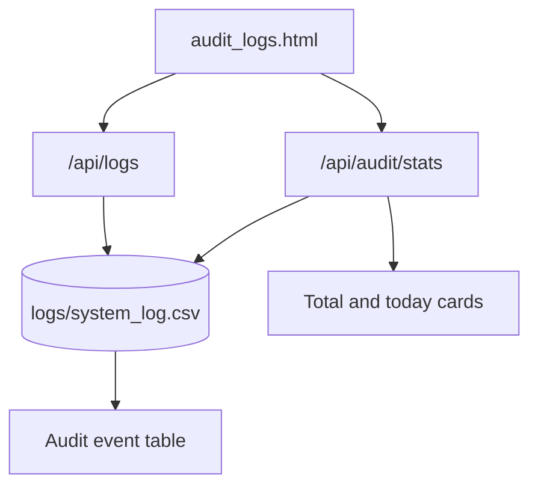
```mermaid
flowchart TB
    AuditLogsPage[audit_logs.html]
    AuditLogsPage --> LogsApi["/api/logs"]
    AuditLogsPage --> AuditStats["/api/audit/stats"]
    LogsApi --> SystemLog[(logs/system_log.csv)]
    AuditStats --> SystemLog
    SystemLog --> AuditTable[Audit event table]
    AuditStats --> SummaryCards[Total and today cards]
```

### Ethics Page

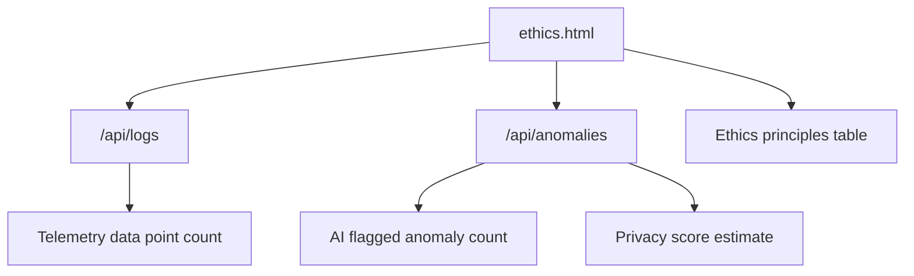
```mermaid
flowchart TB
    EthicsPage[ethics.html]
    EthicsPage --> LogsApi["/api/logs"]
    EthicsPage --> AnomaliesApi["/api/anomalies"]
    LogsApi --> DataPointCount[Telemetry data point count]
    AnomaliesApi --> AnomalyCount[AI flagged anomaly count]
    AnomaliesApi --> PrivacyScore[Privacy score estimate]
    EthicsPage --> Principles[Ethics principles table]
```

### Anomalies Page

```mermaid
flowchart TB
    AnomaliesPage[anomalies.html]
    AnomaliesPage --> AnomaliesApi["/api/anomalies"]
    AnomaliesPage --> HeatmapApi["/api/anomalies/heatmap"]
    AnomaliesPage --> RulesApi["/api/anomaly_rules"]
    AnomaliesPage --> TriggerApi["/api/playbook_trigger"]
    AnomaliesApi --> AnomalyTable[Risk enriched anomaly table]
    HeatmapApi --> DensityHeatmap[24 hour density heatmap]
    RulesApi --> RulePanel[Rule configuration panel]
    TriggerApi --> ResponseModal[Playbook response modal]
```

### Anomaly Detail Page

```mermaid
flowchart TB
    DetailPage[anomaly_detail.html]
    DetailPage --> DetailApi["/api/anomalies/:id"]
    DetailApi --> AnomalyLookup[Find decorated anomaly]
    DetailApi --> TimelineBuilder[_timeline_for_anomaly]
    AnomalyLookup --> DetailStats[Value risk indicator frameworks]
    TimelineBuilder --> RootCauseTimeline[Root cause timeline]
```

### Files Page

```mermaid
flowchart TB
    FilesPage[files.html]
    FilesPage --> FileAccessApi["/api/files/access"]
    FileAccessApi --> BaseDir[Project filesystem scan]
    FileAccessApi --> Classifier[Sensitivity classifier]
    Classifier --> FileRows[File access rows]
    FileRows --> Filters[Sensitivity filter]
    FileRows --> StatCards[Public internal confidential restricted counts]
```

## Feature Workflow Diagrams

### Real-Time Notification Workflow

```mermaid
sequenceDiagram
    participant Sampler as Sampler Thread
    participant Queue as Notification Queue
    participant SSE as /api/notifications
    participant Browser as Base Layout

    Sampler->>Sampler: Detect CPU or memory spike
    Sampler->>Queue: Push anomaly notification
    Browser->>SSE: Open EventSource stream
    SSE->>Queue: Wait for notification
    Queue-->>SSE: Deliver notification
    SSE-->>Browser: Emit SSE message
    Browser->>Browser: Render alert toast
```

### Report Export Workflow

```mermaid
sequenceDiagram
    participant User as Operator
    participant UI as Reports Page
    participant API as Flask Reports API
    participant Logs as Audit Logs
    participant Anoms as Anomaly Loader

    User->>UI: Click CSV or PDF download
    UI->>API: GET /api/reports/download.format
    API->>Anoms: Load decorated anomalies
    API->>Logs: Load recent audit rows
    API->>API: Build framework summary
    API-->>UI: Return file response
```

### Playbook Response Workflow

```mermaid
sequenceDiagram
    participant User as Operator
    participant UI as Anomalies Page
    participant API as /api/playbook_trigger
    participant Anoms as Anomaly Loader
    participant Store as Playbook Store
    participant Runs as Run History

    User->>UI: Click Respond
    UI->>API: POST anomaly_id
    API->>Anoms: Find anomaly
    API->>Store: Find enabled matching playbook
    Store-->>API: Return playbook
    API->>Runs: Record response run
    API-->>UI: Return run status and YAML
```

### Terminal Command Workflow

```mermaid
sequenceDiagram
    participant User as Operator
    participant UI as Terminal Page
    participant WS as Terminal WebSocket
    participant Guard as Command Validator
    participant Proc as subprocess

    User->>UI: Enter diagnostic command
    UI->>WS: Send command text
    WS->>Guard: Validate command and arguments
    alt allowed command
        Guard->>Proc: Execute with shell disabled
        Proc-->>WS: Stream stdout and stderr
        WS-->>UI: Display terminal output
    else blocked command
        Guard-->>WS: Return refusal
        WS-->>UI: Display refusal
    end
```
